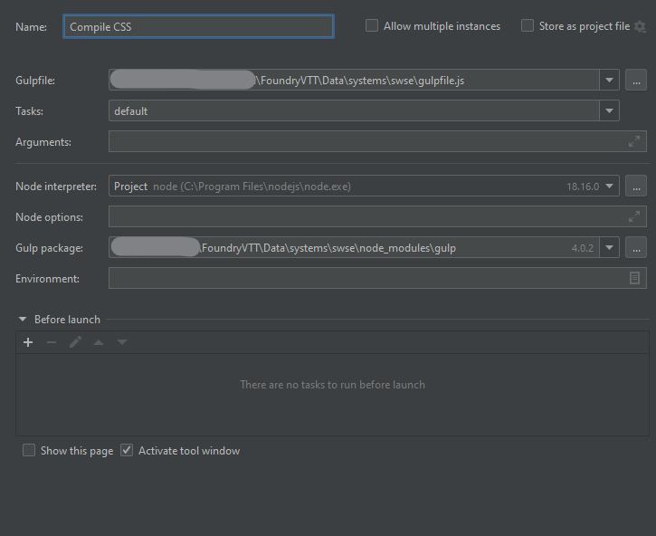

# Contributing to Star Wars: Saga Edition for FoundryVTT

First, I want to say, thank you for contributing.  This project started as an effort to make foundry work better for myself in a game i run for family and friends, and the amount of support it has received is awesome.

There are different ways to contribute:
* Direct contribution: instructions on setup below
* Requesting features: one of the hardest things for a project can be figuring out what to do next.  Create some git issues for bugs that you found or overlooked features that you want to see.
* Spread the word: Star the repository or tell your friends about this project
* Donate: this project will remain completely free.  This would be the case even if it were not a legal grey area.  This project is for fun and will never be monetized even in the impossible case that I am given permission.  That said, if you want to buy me a coffee or beer I won't turn it down.  

## Setup for direct contributions

1. First you will need a licensed installation of [FoundryVTT](https://foundryvtt.com/).  For development, I recommend installing on the machine you are developing on.  You may want to keep this installation separate from the installation you use to play games.  
    * this should be installed outside of the Program Files folders.
2. You will need a [Github](https://github.com/) account and will need to have [git](https://git-scm.com/downloads) installed on your machine.  
3. [Fork](https://docs.github.com/en/pull-requests/collaborating-with-pull-requests/working-with-forks/fork-a-repo) the repository
4. Navigate to the systems folder for your Foundry installation.  Right-clicking on the Foundry shortcut should include a "Browse User Data" option, and from there systems is in the Data folder.  Clone the project there.  When you restart Foundry, it should appear as an available system.
   * Websphere has a project setup option to create a project form a VCS.  that can be done instead of cloning as long as you save to the correct folder
5. Create a development world.  You don't want to use an existing world that you are running a game in.
6. install the modules: [FVTT-Quench](https://github.com/Ethaks/FVTT-Quench) and  [foundryvtt-devMode](https://github.com/League-of-Foundry-Developers/foundryvtt-devMode).  The first one is required for running tests, and the second one provides a lot of helpful tools.  Go and star their repos while you're there.  They do good work.
7. In Quench options, check "Show Quench Dialog on Startup" and "Run on Startup".  This will let you run your tests simply be refreshing your browser.  

At this point you should be able to make changes to the project and debug with the Chromium debugger.  Personally I like using [Webstorm](https://www.jetbrains.com/webstorm/download/#section=windows)  and do pay for a subscription.

### Websphere Setup

1. install [Websphere](https://www.jetbrains.com/webstorm/download/#section=windows)
2. create a new project with the folder you create in the last section, or create from VCS and put the project in the system folder.
3. create a 'Javascript Debug' Configuration the URL should be http://localhost:30000/game.  (if you don't include /game, it will default to the join page every time instead of just the first time) the file/directory should point to the project root folder.
4. CSS is compiled from the scss folder.  create a Gulp.js configuration.   
5. Make sure that gulpfile points to gulpfile.js in the project root, and you'll need to point to a node installation and a gulp installation.

Running the javascript debug configuration as debug will let you debug the project in the IDE.  Rerunning it from the IDE will run with any changes you've made.  Refreshing the browser sometimes picks up changes on refresh if you refresh the browser.
Running the gulpfile configuration starts a service that will detect changes in the scss file and automatically compile them to the css folder to be picked up on refresh.

## Merging Back

Merging back to the project has a few steps.

1. push your changes back to your fork
2. open a Pull Request to main from your fork

### Pull Requests

Pull requests should follow these rules.

1. pull requests should reference the issue that they are addressing.  this can be done by putting a '#' in front of the issue number
2. pull requests should have appropriate tests to show that the new functionality works and any test that shows that adjacent functionality isn't be affected
3. pull requests should not include changes that are not related to the issue when possible.  try to put formatting changes that aren't related to the issue in a separate request

